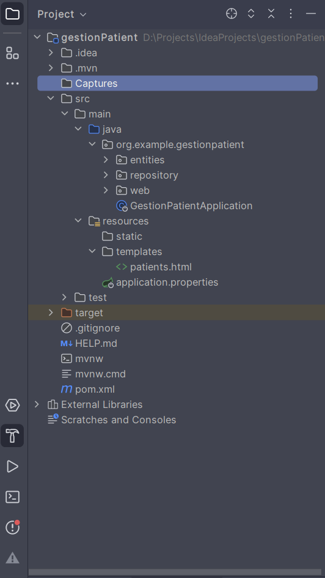
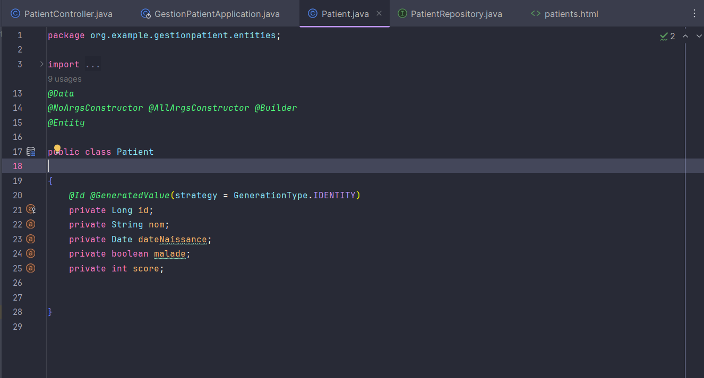
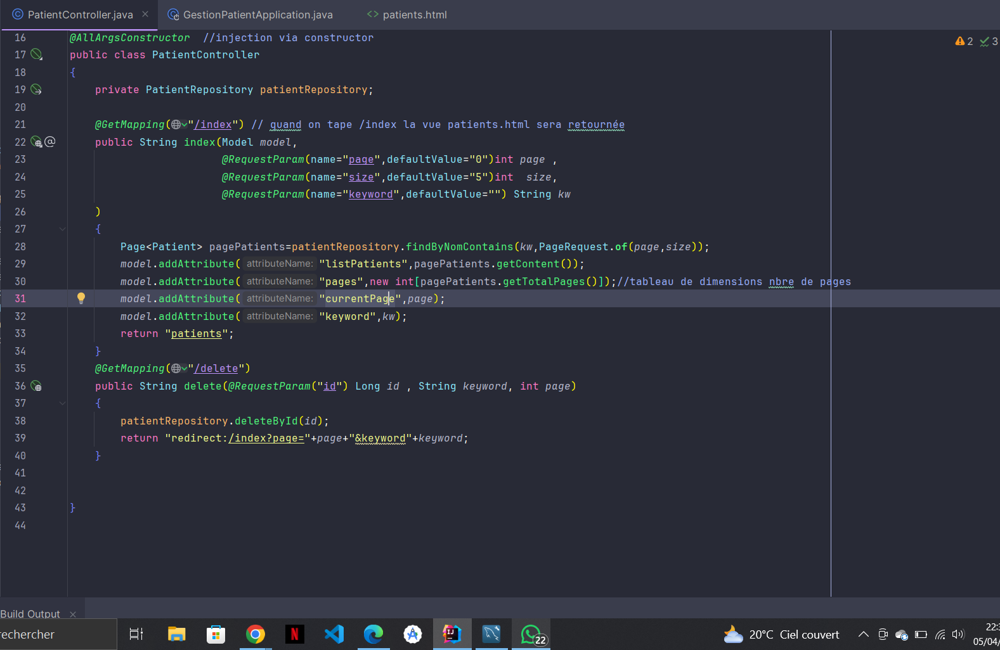
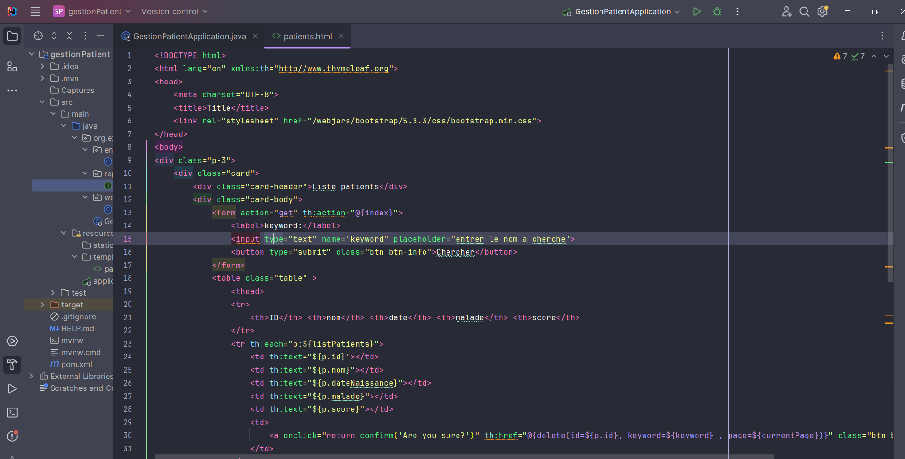
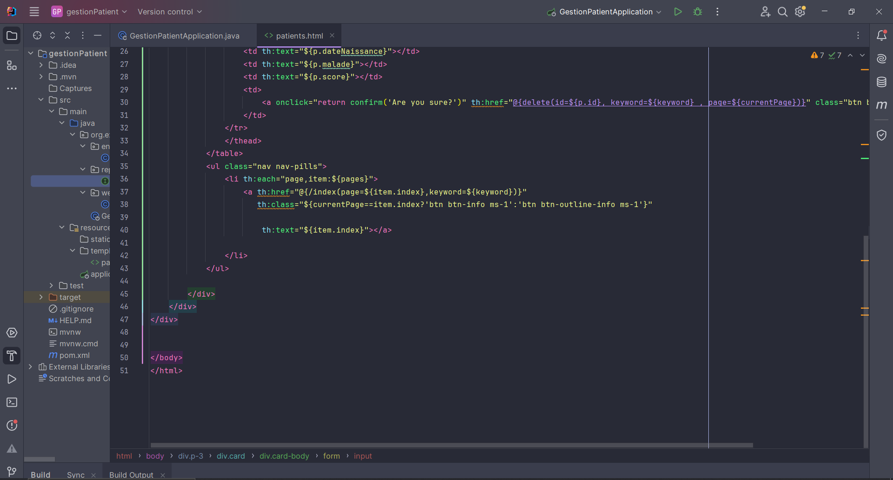

<h1>Compte Rendu</h1>
<h2>Gestion des patients en utilisant Spring MVC , architecture rendu Serveur</h2>

<h3>La structure de projet :</h3>

L'image représente la structure de mon projet ainsi que les trois packages :
- entities  
-repository 
-web

<h3>L'entité patient :</h3>

Dans le package "entities", j'ai créé l'entité "Patient" avec ses attributs

<h3>L'interface PatientRepository (Spring Data)</h3>

<h3>Le contolleur</h3>

Dans le package "web" ,j'ai créé le controlleur PatientController

<h3>La vue responsable de l'affichage aux utilisateurs :</h3>

